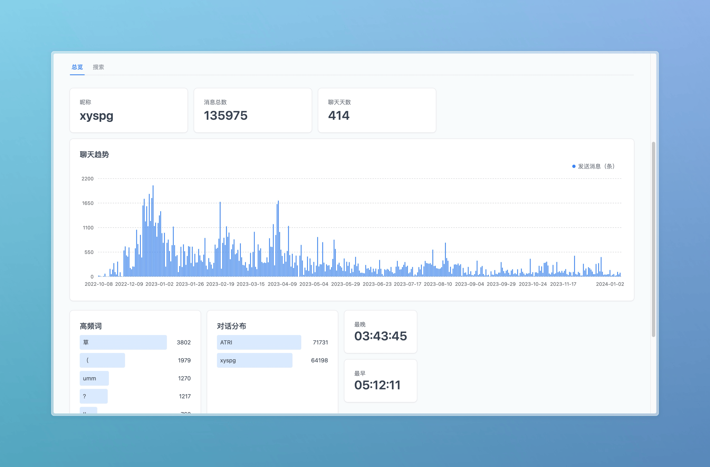

# Telegram Chat History Analyzer
[English](README.md) | [简体中文](README.zh.md) 


## Features
- Analysis on each contact
- Data visualization, chat trends, statistics, etc
- High frequency words
- Chat search

## Use Locally
1. Clone the repository or download zip
2. Install docker and docker-compose
3. Build the image in the root directory of the project
```bash
docker-compose up --build
```
4. Open the browser and visit `http://localhost:3000`
5. To stop the service, press `Ctrl+C`
6. Run `docker-compose up` to restart the service